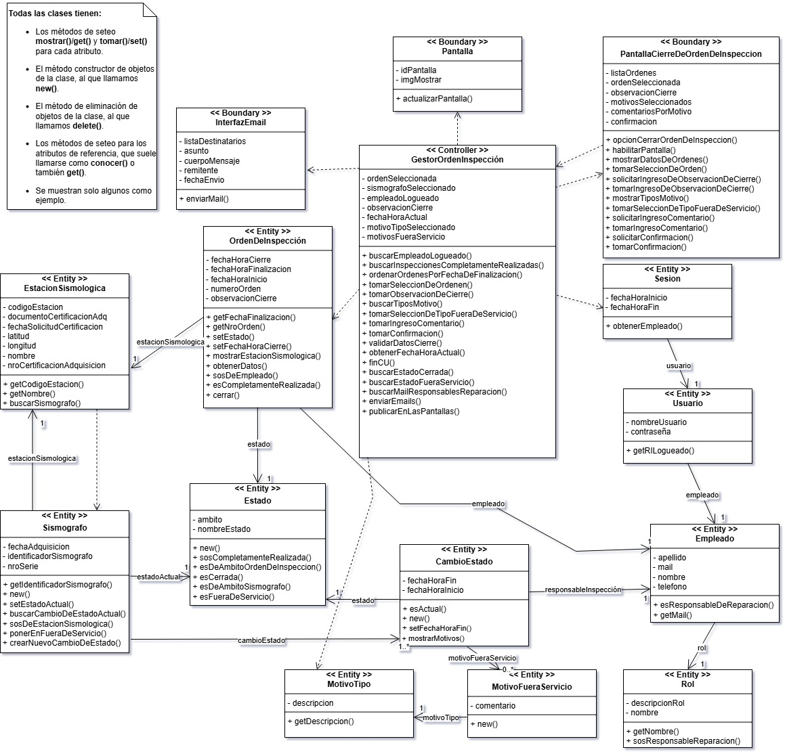

# RED SISMICA
## Proyecto de Aplicacion Integrador - Diseño De Sistemas De Informacion

En este trabajo practico se lleva a cabo la realizacion de un caso de uso especifico (C.U N°37) del sistema de informacion de una Red Sismica Digital Virtual, el cual se encarga de  gestionar y coordinar la conexión entre Estaciones Sismológicas (ES) distribuidas en el país y en países limítrofes.

## Diagramas del análisis 
### Diagrama de clases
Utilizamos el diagrama de clases para poder definir las relaciones entre las diferentes entidades del dominio y las entidades de la solucion.

### Diagrama de secuencia
Utilizamos este diagrama para ver como se comporta el sistema en tiempo de ejecucion y como interactuan las entidades entre si medieante el envio de mensajes.

para ver el diagrama de secuencia [Abrir Diagrama De Secuencia](documentacion/DiagramaDeSecuencia.pdf)
